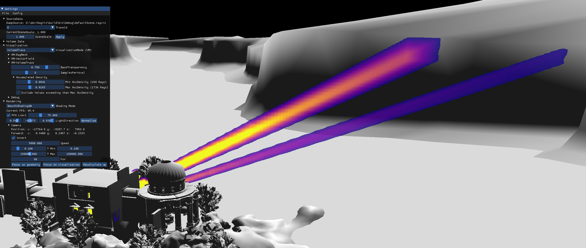

# RayVis Thesis

Raytracing is rapidly gaining popularity in game development.
When debugging raytracing algorithms, one question to be looked at is "Which
parts of the scene are traversed by how many rays?". This thesis presents RayVis,
a tool for visualizing large rays data sets in a 3D scene. RayVis provides three
different visualizations for answering questions about the density and location of
rays. The first visualization draws the rays as 3D meshes into the scene. The
second one visualizes the ray density and direction in a vector field. And the last
fone visualization the ray density as volume.

